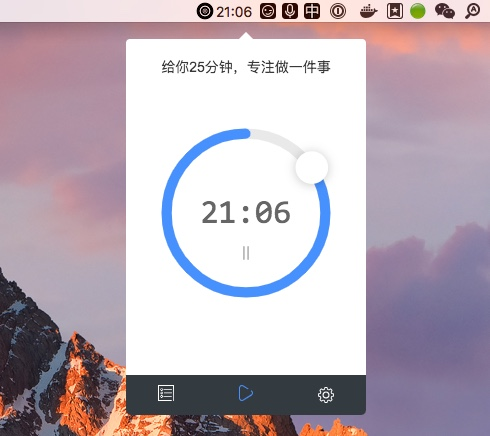
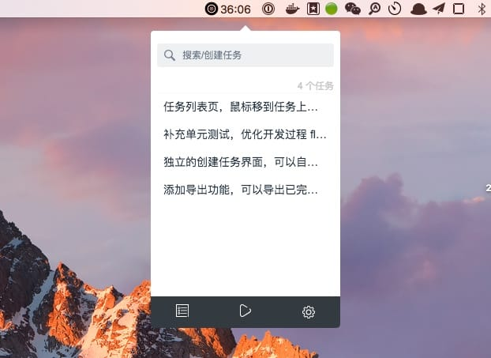

<div align="center">
	
	<h2 >Focus</h2>
</div>

[](https://www.travis-ci.org/HelKyle/focus)
[](https://github.com/HelKyle/focus/pulls)

一款离线，高颜值的🍅工作软件，二十五分钟专注做一件事⭐️。





### 🤝 参与开发

```
git clone https://github.com/HelKyle/focus.git

cd focus

yarn && yarn dev
```

### 下载
可以在 [👉release👈](https://github.com/HelKyle/focus/releases) 页面看到发布版本，点击下载即可。


### 🤓 Todo
- [ ] 添加导出功能，可以导出已完成任务 `Markdown` 格式
- [ ] 番茄工作法，每25分钟之后需要修复5分钟，4个25分钟之后需要休息25分钟
- [ ] 独立的创建任务界面，可以自定义每个任务的完成时间
- [ ] 任务列表页，鼠标移到任务上，任务名字需要循环滚动
- [ ] 补充单元测试，优化开发过程 flow 体验

### License
MIT
